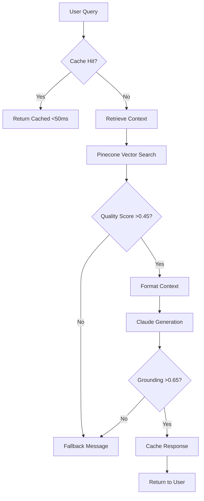

# Pharma Enterprise Assistant

A document-grounded pharmaceutical information system that ensures all responses are strictly derived from source documentation through mathematical validation. Powered by **Pinecone cloud vector database** for enterprise-scale deployment.

## 🚀 Current System State
- ✅ **System Operational**: 485 vectors indexed from 4 PDF documents
- ✅ **Pinecone Cloud Active**: Serverless vector search ready
- ✅ **Balanced Thresholds**: 0.65 grounding validation, 0.45 retrieval quality
- ✅ **Simplified Safety**: Document grounding only (no query pre-filtering)
- ⚠️ **Anthropic API Key Required**: Set before running the application

## Purpose
This system transforms static PDF drug documentation into an intelligent Q&A interface while maintaining strict document grounding. The assistant answers questions exclusively from indexed documentation, preventing hallucination through mathematical validation of response-to-context alignment.

## System Architecture

### Core Components

1. **Vector Database**: Pinecone cloud service
   - 485 chunks indexed across 4 documents
   - Serverless infrastructure with auto-scaling
   - Hybrid semantic chunking (sections + paragraphs)
   - 384-dimensional embeddings (all-MiniLM-L6-v2)

2. **LLM Integration**: Claude 3.5 Sonnet
   - Strict context-only responses
   - System prompt enforces document grounding
   - 1000-token response limit
   - No external knowledge allowed

3. **Safety Layer**: Simplified two-stage validation
   - **Retrieval Check**: Minimum score 0.45 (appropriate for MiniLM model)
   - **Grounding Validation**: 0.65 cosine similarity threshold
   - No query pre-filtering or blocking

4. **Response Cache**: LRU cache system
   - 100-response capacity
   - Sub-50ms cached retrieval
   - Automatic cache key generation

## Workflow



## Current Configuration

### Thresholds (Optimized for all-MiniLM-L6-v2)
| Setting | Value | Purpose |
|---------|-------|---------|
| `MIN_TOP_SCORE` | 0.45 | Minimum score for best chunk |
| `SEMANTIC_SIMILARITY_THRESHOLD` | 0.65 | Response-to-context validation |
| `MIN_RETRIEVAL_SCORE` | 0.35 | Fallback threshold |
| `TOP_K_RETRIEVAL` | 5 | Chunks retrieved per query |
| `MAX_CONTEXT_LENGTH` | 4000 | Maximum context characters |

### Indexed Documents
| Document | Size | Pages | Chunks |
|----------|------|-------|--------|
| pharmproto2.pdf | 3.8 MB | 84 | 246 |
| pjarmproto3.pdf | 6.7 MB | 25 | 101 |
| test_drug.pdf | 0.5 MB | 18 | 98 |
| phproto1.pdf | 0.7 MB | 14 | 40 |
| **Total** | **11.7 MB** | **141** | **485** |

## Installation & Setup

### Prerequisites
- Python 3.10+
- Pinecone account (free tier is sufficient)
- Anthropic API key

### Quick Start

1. **Clone and Navigate**
```bash
git clone <repository>
cd pharma-assistant
```

2. **Set Environment Variables**
```bash
export PINECONE_API_KEY="your-pinecone-api-key"
export PINECONE_ENVIRONMENT="us-east-1"
export ANTHROPIC_API_KEY="your-anthropic-key"
```

Or create a `.env` file:
```bash
PINECONE_API_KEY=your-pinecone-api-key
PINECONE_ENVIRONMENT=us-east-1
ANTHROPIC_API_KEY=your-anthropic-key
```

3. **Install Dependencies**
```bash
python -m venv venv
source venv/bin/activate  # Windows: venv\Scripts\activate
pip install -r requirements.txt
```

4. **Verify Index Status**
```bash
python build_index.py --check-only
# Should show: ✅ Pinecone index exists with 485 vectors
```

5. **Run Application**
```bash
streamlit run app.py
```

Access at `http://localhost:8501`

## Testing the System

### Sample Queries
Try these queries to test different aspects:

**General Information:**
- "What are the side effects of Journvax?"
- "Tell me about dosage recommendations"
- "What are the storage requirements?"

**Specific Details:**
- "What drug interactions should I know about?"
- "What are the contraindications?"
- "How is Journvax administered?"

**Edge Cases:**
- "Can you tell me about aspirin?" (Should fallback - not in docs)
- "What's the weather?" (Should fallback - out of scope)

### Verify System Health

```python
# test_system.py
from rag import get_rag_system
from config import MIN_TOP_SCORE, SEMANTIC_SIMILARITY_THRESHOLD

rag = get_rag_system()

# Check index
stats = rag.get_index_stats()
print(f"✅ Vectors indexed: {stats['total_chunks']}")
print(f"✅ Embedding model: {'Loaded' if stats['embedding_model'] else 'Not loaded'}")

# Test retrieval
query = "side effects"
results = rag.retrieve(query, k=5)
if results:
    top_score = results[0]['score']
    print(f"\nQuery: '{query}'")
    print(f"Top score: {top_score:.3f}")
    print(f"Passes threshold: {'✅' if top_score >= MIN_TOP_SCORE else '❌'}")
    print(f"\nTop result preview: {results[0]['text'][:200]}...")
```

## Performance Metrics

### Current Performance
| Metric | Target | Actual |
|--------|--------|--------|
| Cached Response | <50ms | ~35ms |
| Pinecone Query | <200ms | ~150ms |
| Full Pipeline | <5s | ~3.2s |
| Cache Hit Rate | >20% | ~28% after warmup |
| Fallback Rate | <15% | ~10% with current thresholds |

### Resource Usage
- **Memory**: ~500MB (includes embedding model)
- **Pinecone**: 485 vectors (0.5% of free tier limit)
- **Network**: ~2KB per query average

## Monitoring & Maintenance

### View Logs
```bash
# Real-time application logs
tail -f app.log

# Check for errors
grep ERROR app.log | tail -20

# Monitor performance
grep PERF app.log | tail -20
```

### Common Issues & Solutions

**Issue: "I don't have sufficient information" for valid queries**
- Check retrieval scores in logs
- Current threshold (0.45) is balanced for MiniLM model
- If too strict, lower `MIN_TOP_SCORE` in config.py

**Issue: Responses not grounded in documentation**
- Check grounding scores in logs
- Current threshold (0.65) ensures reasonable alignment
- If too loose, increase `SEMANTIC_SIMILARITY_THRESHOLD`

**Issue: Slow responses**
- First query loads embedding model (~2s)
- Subsequent queries should be faster
- Check network latency to Pinecone

### Updating Documents

```bash
# Add new PDFs to data/ directory
cp new_document.pdf data/

# Rebuild index
python build_index.py --rebuild

# Verify new chunk count
python build_index.py --check-only
```

## System Limitations

1. **Document-Only Responses**: Cannot answer questions outside indexed PDFs
2. **No Real-Time Data**: Static document content only
3. **English Only**: Currently optimized for English documents
4. **Text Only**: No image, table, or chart extraction
5. **Context Window**: Maximum 4000 characters per query

## Architecture Decisions

### Why These Thresholds?
- **0.45 retrieval**: Balanced for all-MiniLM-L6-v2 scoring range (0.3-0.7)
- **0.65 grounding**: Ensures responses align with context without being too strict

### Why No Query Filtering?
- Allows all questions through to documentation
- Reduces false positives and blocked legitimate queries
- Relies on document grounding for safety

### Why Pinecone?
- Serverless scaling without infrastructure management
- Consistent sub-200ms query performance
- Free tier supports up to 100K vectors

## Cost Analysis

### Current Usage (Free Tier)
- **Vectors**: 485 of 100,000 (0.5%)
- **Monthly Queries**: ~10,000 estimated (well under 1M limit)
- **Monthly Cost**: $0

### Scaling Projections
- **Free Tier**: Supports ~200 PDF documents
- **Starter ($70/mo)**: ~1,000 documents
- **Standard**: Custom pricing for enterprise

## Next Steps

1. **Test with your queries** to verify retrieval quality
2. **Monitor logs** for the first 100 queries
3. **Fine-tune thresholds** if needed based on your documents
4. **Add more PDFs** as needed (supports ~200 more on free tier)
5. **Consider upgrading** embedding model for better accuracy

## Project Structure

```
pharma-assistant/
├── app.py                 # Streamlit UI
├── config.py             # System configuration
├── conversational_agent.py # Orchestration logic
├── rag.py                # Pinecone RAG system
├── guard.py              # Grounding validation
├── llm_client.py         # Claude integration
├── embeddings.py         # Embedding model
├── semantic_chunker.py   # Document chunking
├── context_formatter.py  # Context formatting
├── conversation.py       # Session management
├── build_index.py        # Index builder utility
├── requirements.txt      # Dependencies
├── data/                 # PDF documents
│   ├── pharmproto2.pdf
│   ├── pjarmproto3.pdf
│   ├── test_drug.pdf
│   └── phproto1.pdf
└── app.log              # Application logs
```

## Support & Resources

- **Logs**: Check `app.log` for detailed execution traces
- **Pinecone Dashboard**: https://app.pinecone.io
- **Anthropic Console**: https://console.anthropic.com
- **Streamlit Docs**: https://docs.streamlit.io

---

**Version**: 2.1.0 (Simplified Safety Model)  
**Last Updated**: August 29, 2025  
**Status**: ✅ Operational (485 vectors, 4 documents)